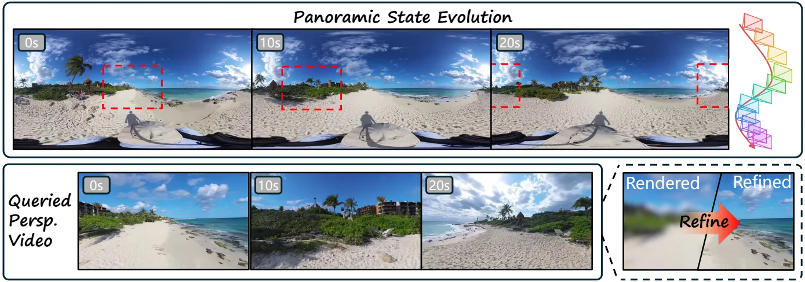

<h1 align="center">AlayaVista</h1>
<h3 align="center">Streaming World Modeling from Panoramic States to Perspective Video</h3>

<p align="center"><a href="https://alayalab.ai/"><b>Alaya Lab</b></a></p>

<p align="center">
  <a href="https://alaya-lab.github.io/AlayaVista/"></a>
  <a href="https://alaya-lab.github.io/AlayaVista/assets/AlayaVista.pdf"></a>
</p>

<p align="center">
  
</p>

<p align="center"><i>Maintain panoramic context. Refine the view you choose.</i></p>

**AlayaVista** is a camera-controllable streaming video world model that starts from a single perspective image. It constructs a 360° scene prior, evolves camera-conditioned panoramic latent states, and synthesizes the requested perspective video through latent viewport rendering and local refinement. Chunk-autoregressive generation and few-step distillation enable efficient streaming while concentrating high-fidelity synthesis on the selected viewport.

We also introduce **MUGEN**, a real-world panoramic video dataset with **1,318 hours** of videos at **4K or higher**, rich semantic and geometric annotations, and a **300-hour MUGEN-HQ** subset. AlayaVista is trained on MUGEN and the panoramic subset of Sekai2.

## 📰 News

- The [project page](https://alaya-lab.github.io/AlayaVista/) and [technical report](https://alaya-lab.github.io/AlayaVista/assets/AlayaVista.pdf) are available.

## 🚀 Release Roadmap

- [x] Project page
- [x] Technical report
- [ ] Inference code
- [ ] Pretrained weights

## Citation

```bibtex
@techreport{tan2026alayavista,
  title       = {AlayaVista: Streaming World Modeling from Panoramic States to Perspective Video},
  author      = {Tan, Jiaming and Zhai, Mingliang and Li, Zhen and Wu, Yuwei and Li, Chuanhao and Zhang, Kaipeng},
  institution = {Alaya Lab},
  year        = {2026},
  url         = {https://alaya-lab.github.io/AlayaVista/assets/AlayaVista.pdf}
}
```
